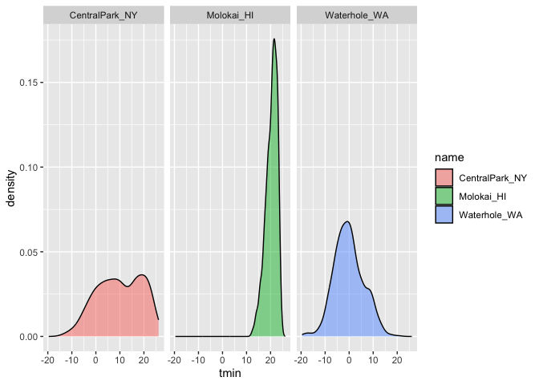

Visualization
================

``` r
library(tidyverse)
```

    ## ── Attaching core tidyverse packages ──────────────────────── tidyverse 2.0.0 ──
    ## ✔ dplyr     1.1.4     ✔ readr     2.1.5
    ## ✔ forcats   1.0.0     ✔ stringr   1.5.1
    ## ✔ ggplot2   3.5.1     ✔ tibble    3.2.1
    ## ✔ lubridate 1.9.3     ✔ tidyr     1.3.1
    ## ✔ purrr     1.0.2     
    ## ── Conflicts ────────────────────────────────────────── tidyverse_conflicts() ──
    ## ✖ dplyr::filter() masks stats::filter()
    ## ✖ dplyr::lag()    masks stats::lag()
    ## ℹ Use the conflicted package (<http://conflicted.r-lib.org/>) to force all conflicts to become errors

``` r
library(patchwork)
```

``` r
weather_df = read_csv(file = "./data/weather_df.csv")
```

    ## Rows: 2190 Columns: 6
    ## ── Column specification ────────────────────────────────────────────────────────
    ## Delimiter: ","
    ## chr  (2): name, id
    ## dbl  (3): prcp, tmax, tmin
    ## date (1): date
    ## 
    ## ℹ Use `spec()` to retrieve the full column specification for this data.
    ## ℹ Specify the column types or set `show_col_types = FALSE` to quiet this message.

``` r
weather_df
```

    ## # A tibble: 2,190 × 6
    ##    name           id          date        prcp  tmax  tmin
    ##    <chr>          <chr>       <date>     <dbl> <dbl> <dbl>
    ##  1 CentralPark_NY USW00094728 2021-01-01   157   4.4   0.6
    ##  2 CentralPark_NY USW00094728 2021-01-02    13  10.6   2.2
    ##  3 CentralPark_NY USW00094728 2021-01-03    56   3.3   1.1
    ##  4 CentralPark_NY USW00094728 2021-01-04     5   6.1   1.7
    ##  5 CentralPark_NY USW00094728 2021-01-05     0   5.6   2.2
    ##  6 CentralPark_NY USW00094728 2021-01-06     0   5     1.1
    ##  7 CentralPark_NY USW00094728 2021-01-07     0   5    -1  
    ##  8 CentralPark_NY USW00094728 2021-01-08     0   2.8  -2.7
    ##  9 CentralPark_NY USW00094728 2021-01-09     0   2.8  -4.3
    ## 10 CentralPark_NY USW00094728 2021-01-10     0   5    -1.6
    ## # ℹ 2,180 more rows

## Remember this plot …?

``` r
weather_df %>%
  ggplot(aes(x=tmin, y=tmax, color = name))+
  geom_point(alpha=.5)
```

    ## Warning: Removed 17 rows containing missing values or values outside the scale range
    ## (`geom_point()`).

<!-- -->

## Labels

``` r
weather_df %>%
  ggplot(aes(x=tmin, y=tmax, color = name))+
  geom_point(alpha=.5)+
  labs(
    title = "Temperature Plot",
    x = "Min daily temp (C)",
    y = "Max daily temp (C)",
    caption = "Data from rnoaa package; temperatures in 2021"
  )
```

    ## Warning: Removed 17 rows containing missing values or values outside the scale range
    ## (`geom_point()`).

<!-- -->

## Scales

start with the same plot

``` r
weather_df %>%
  ggplot(aes(x=tmin, y=tmax, color = name))+
  geom_point(alpha=.5)+
  labs(
    title = "Temperature Plot",
    x = "Min daily temp (C)",
    y = "Max daily temp (C)",
    caption = "Data from rnoaa package; temperatures in 2021"
  )+
  scale_x_continuous(
    breaks = c(-15, 0, 15),
    labels = c("-15 C", "0", "15")
  )+
  scale_y_continuous(
    trans = "sqrt",
    position = "right"
  )
```

    ## Warning in transformation$transform(x): NaNs produced

    ## Warning in scale_y_continuous(trans = "sqrt", position = "right"): sqrt
    ## transformation introduced infinite values.

    ## Warning: Removed 142 rows containing missing values or values outside the scale range
    ## (`geom_point()`).

<!-- -->

Look at color scales

first example

``` r
weather_df %>%
  ggplot(aes(x=tmin, y=tmax, color = name))+
  geom_point(alpha=.5)+
  labs(
    title = "Temperature Plot",
    x = "Min daily temp (C)",
    y = "Max daily temp (C)",
    caption = "Data from rnoaa package; temperatures in 2021"
  )+
 scale_color_hue(h=c(100,300))
```

    ## Warning: Removed 17 rows containing missing values or values outside the scale range
    ## (`geom_point()`).

<!-- -->

changing the title of key using name argument

``` r
weather_df %>%
  ggplot(aes(x=tmin, y=tmax, color = name))+
  geom_point(alpha=.5)+
  labs(
    title = "Temperature Plot",
    x = "Min daily temp (C)",
    y = "Max daily temp (C)",
    caption = "Data from rnoaa package; temperatures in 2021"
  )+
 scale_color_hue(
   name = "location",
   h=c(100,300))
```

    ## Warning: Removed 17 rows containing missing values or values outside the scale range
    ## (`geom_point()`).

<!-- -->

professor’s preferred method

``` r
weather_df %>%
  ggplot(aes(x=tmin, y=tmax, color = name))+
  geom_point(alpha=.5)+
  labs(
    title = "Temperature Plot",
    x = "Min daily temp (C)",
    y = "Max daily temp (C)",
    caption = "Data from rnoaa package; temperatures in 2021"
  )+
 viridis::scale_color_viridis(
   name = "location",
   discrete=TRUE)
```

    ## Warning: Removed 17 rows containing missing values or values outside the scale range
    ## (`geom_point()`).

<!-- -->

## Themes

shift the legend

``` r
weather_df %>%
  ggplot(aes(x=tmin, y=tmax, color = name))+
  geom_point(alpha=.5)+
  labs(
    title = "Temperature Plot",
    x = "Min daily temp (C)",
    y = "Max daily temp (C)",
    caption = "Data from rnoaa package; temperatures in 2021"
  )+
 viridis::scale_color_viridis(
   name = "location",
   discrete=TRUE)+
  theme(legend.position = "bottom")
```

    ## Warning: Removed 17 rows containing missing values or values outside the scale range
    ## (`geom_point()`).

<!-- -->

change the overall theme

``` r
weather_df %>%
  ggplot(aes(x=tmin, y=tmax, color = name))+
  geom_point(alpha=.5)+
  labs(
    title = "Temperature Plot",
    x = "Min daily temp (C)",
    y = "Max daily temp (C)",
    caption = "Data from rnoaa package; temperatures in 2021"
  )+
 viridis::scale_color_viridis(
   name = "location",
   discrete=TRUE)+
  theme_bw()
```

    ## Warning: Removed 17 rows containing missing values or values outside the scale range
    ## (`geom_point()`).

<!-- -->

``` r
weather_df %>%
  ggplot(aes(x=tmin, y=tmax, color = name))+
  geom_point(alpha=.5)+
  labs(
    title = "Temperature Plot",
    x = "Min daily temp (C)",
    y = "Max daily temp (C)",
    caption = "Data from rnoaa package; temperatures in 2021"
  )+
 viridis::scale_color_viridis(
   name = "location",
   discrete=TRUE)+
  theme_minimal()
```

    ## Warning: Removed 17 rows containing missing values or values outside the scale range
    ## (`geom_point()`).

<!-- -->

other ones are theme_classic() that has no gridlines, a bunch in
ggthemes package (theme_economist, theme_excel, etc.)

``` r
weather_df %>%
  ggplot(aes(x=tmin, y=tmax, color = name))+
  geom_point(alpha=.5)+
  labs(
    title = "Temperature Plot",
    x = "Min daily temp (C)",
    y = "Max daily temp (C)",
    caption = "Data from rnoaa package; temperatures in 2021"
  )+
 viridis::scale_color_viridis(
   name = "location",
   discrete=TRUE)+
 ggthemes::theme_excel()
```

    ## Warning: Removed 17 rows containing missing values or values outside the scale range
    ## (`geom_point()`).

<!-- -->

professor likes theme_minimal best

applying theme after other things will override those original things.
so you need to tweak the overall theme. for example with moving the
legend

``` r
weather_df %>%
  ggplot(aes(x=tmin, y=tmax, color = name))+
  geom_point(alpha=.5)+
  labs(
    title = "Temperature Plot",
    x = "Min daily temp (C)",
    y = "Max daily temp (C)",
    caption = "Data from rnoaa package; temperatures in 2021"
  )+
 viridis::scale_color_viridis(
   name = "location",
   discrete=TRUE)+
theme(legend.position = "bottom")
```

    ## Warning: Removed 17 rows containing missing values or values outside the scale range
    ## (`geom_point()`).

<!-- -->

## Setting options

this is something/options he would normally put at the very beginning of
a document

``` r
library(tidyverse)

knitr::opts_chunk$set(
  fig.width = 6,
  fig.asp = .6,
  out.width = "90%"
)

theme_set(theme_minimal()+theme(legend.position = "bottom"))

options(
  ggplot2.continuous.colour = "viridis",
  ggplot2.continuous.fill = "viridis"
)

scale_color_discrete = scale_color_viridis_d
scale_fill_discrete = scale_fill_viridis_d
```

## Data args in ‘geom’

basically below we creat two data sets, then apply two geometries. in
the second example, we apply each geometry to a different dataset

``` r
central_park =
  weather_df %>%
  filter(name == "CentralPark_NY")

molokai =
  weather_df %>%
  filter(name == "Molokai_HI")

ggplot(data = molokai, aes(x=date, y=tmax, color=name))+
  geom_point()+
  geom_line()
```

    ## Warning: Removed 1 row containing missing values or values outside the scale range
    ## (`geom_point()`).

<!-- -->

``` r
ggplot(data = molokai, aes(x=date, y=tmax, color=name))+
  geom_point()+
  geom_line(data = central_park)
```

    ## Warning: Removed 1 row containing missing values or values outside the scale range
    ## (`geom_point()`).

<!-- -->

## Patchwork

remeber faceting? it lets you put the same plot types side by side

``` r
weather_df %>%
  ggplot(aes(x=tmin, fill=name))+
  geom_density(alpha=.5)+
  facet_grid(.~name)
```

    ## Warning: Removed 17 rows containing non-finite outside the scale range
    ## (`stat_density()`).

<!-- -->

what happens when yuou want multipanel plots but can’t facet …..?

``` r
tmin_tmax_p=
  weather_df %>%
  ggplot(aes(x=tmin, y=tmax, color=name))+
  geom_point(alpha=.5)+
  theme(legend.position = "none")

prcp_dens_p =
  weather_df %>%
  filter(prcp > 0) %>%
  ggplot(aes(x=prcp, fill=name))+
  geom_density(alpha=.5)

tmax_date_p =
  weather_df %>%
  ggplot(aes(x=date, y=tmax, color=name))+
  geom_point()+
  geom_smooth(se=FALSE)+
  theme(legend.positon = "none")

tmin_tmax_p + prcp_dens_p + tmax_date_p
```

    ## Warning: Removed 17 rows containing missing values or values outside the scale range
    ## (`geom_point()`).

    ## `geom_smooth()` using method = 'loess' and formula = 'y ~ x'

    ## Warning: Removed 17 rows containing non-finite outside the scale range
    ## (`stat_smooth()`).

    ## Warning in plot_theme(plot): The `legend.positon` theme element is not defined
    ## in the element hierarchy.

    ## Warning: Removed 17 rows containing missing values or values outside the scale range
    ## (`geom_point()`).

<!-- -->

can also adjust how they show up in the panels in various ways

``` r
tmin_tmax_p /( prcp_dens_p + tmax_date_p)
```

    ## Warning: Removed 17 rows containing missing values or values outside the scale range
    ## (`geom_point()`).

    ## `geom_smooth()` using method = 'loess' and formula = 'y ~ x'

    ## Warning: Removed 17 rows containing non-finite outside the scale range
    ## (`stat_smooth()`).

    ## Warning in plot_theme(plot): The `legend.positon` theme element is not defined
    ## in the element hierarchy.

    ## Warning: Removed 17 rows containing missing values or values outside the scale range
    ## (`geom_point()`).

<!-- -->

## Data Manipulation

Control your factors.

``` r
weather_df %>%
  mutate(
    name = factor(name),
    name = forcats:: fct_relevel(name, c("Molokai_HI"))
  ) %>%
  ggplot(aes(y=tmax, x=name, fill=name))+
  geom_violin(alpha=.5)
```

    ## Warning: Removed 17 rows containing non-finite outside the scale range
    ## (`stat_ydensity()`).

<!-- -->

What if I wanted densities for tmin and tmax simultaneously?

``` r
weather_df %>%
  pivot_longer(
    tmax:tmin,
    names_to = "observation",
    values_to = "temperature"
  ) %>%
  ggplot(aes(x=temperature, fill = observation))+
  geom_density(alpha=.5)+
  facet_grid(. ~ name)
```

    ## Warning: Removed 34 rows containing non-finite outside the scale range
    ## (`stat_density()`).

<!-- -->
